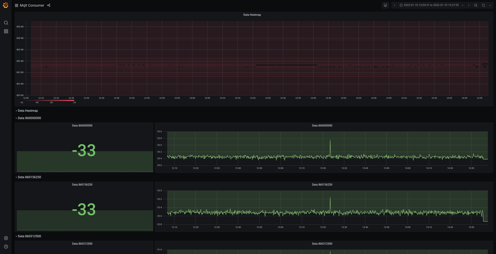
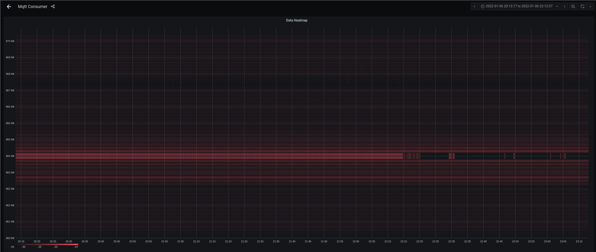
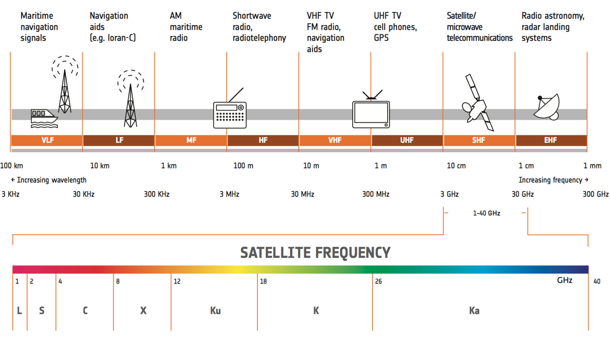
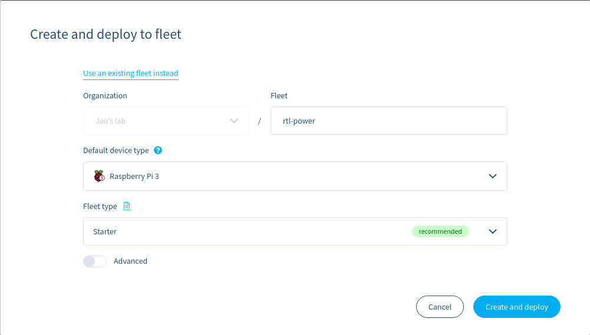
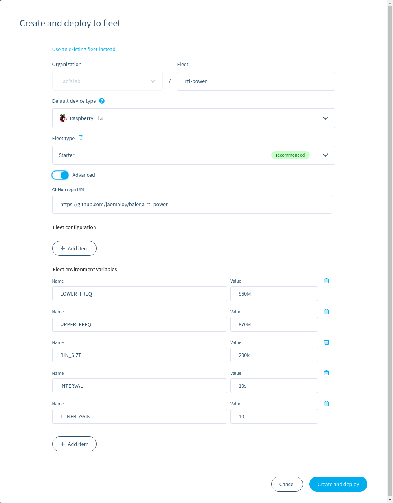
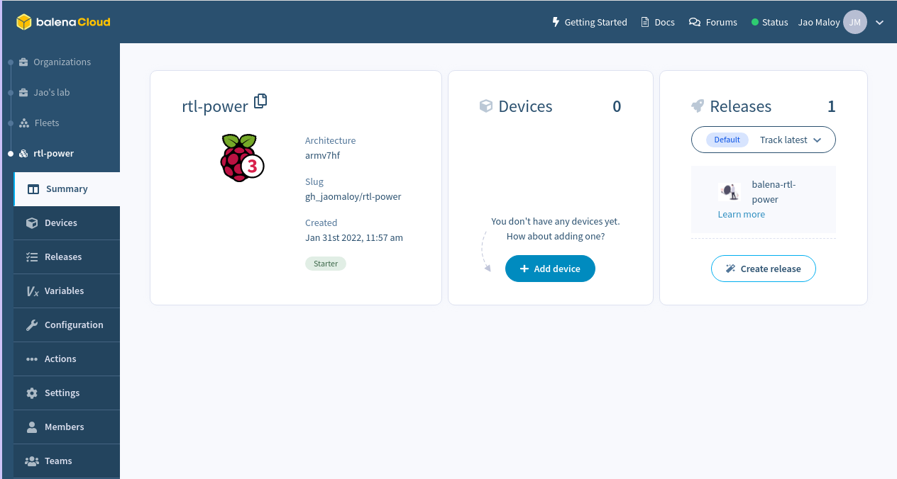
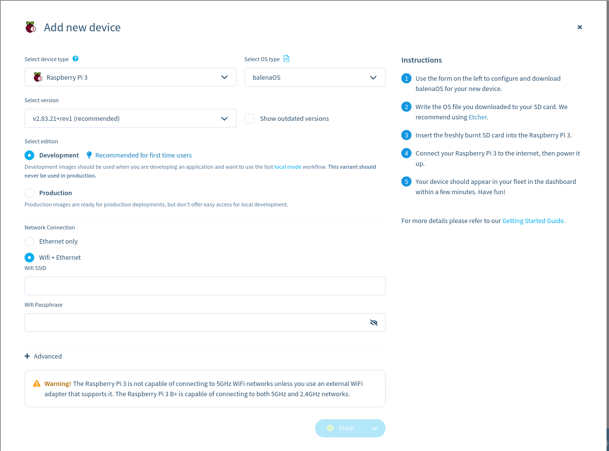
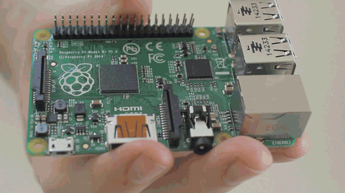
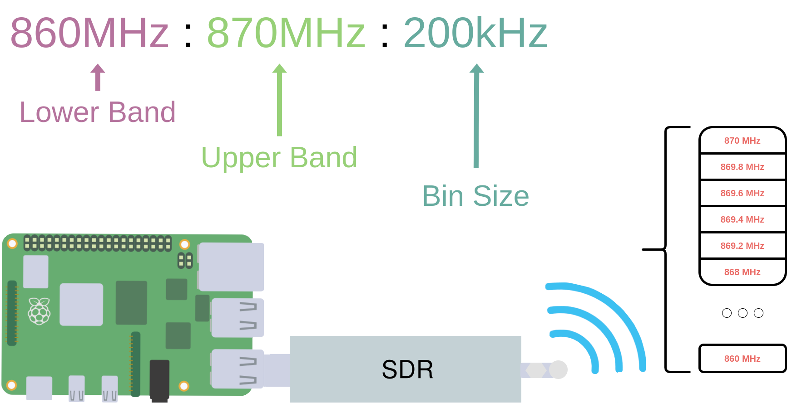
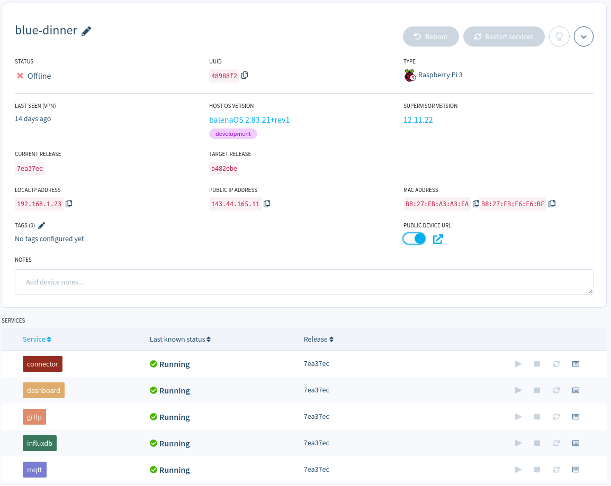

# Visualize and analyze radio waves with Balena RTL Power – A Balena labs residency project

- Execution Time: 1h
- Difficulty: Easy - Medium
- Cost: $80 - 85

- [Introduction](#introduction)
    - [Why?](#why)
    - [Why not existing solutions?](#why-not-existing-solutions)
    - [Why not rtl_power alone?](#why-not-rtl_power-alone)
    - [What's needed?](#what-is-needed)
- [Deploying the fleet](#deploying-the-fleet)
- [Usage and Customization](#usage-and-customization)
    - [Customizing variables](#customizing-variables)
    - [Viewing the heatmap](#viewing-the-heatmap)
- [Design](#design)
- [Next steps](#next-steps)

## Introduction
Balena RTL Power, a project to visualize and analyze signal frequency bands in a simpler and general way. This uses a [Software Defined Radio](https://www.wirelessinnovation.org/assets/documents/SoftwareDefinedRadio.pdf) (SDR), [rtl_power](http://kmkeen.com/rtl-power/) and balena!

#### Why
Common wireless systems rely on some form of radio waves. These waves are differentiated by [frequency bands](https://www.jemengineering.com/blog-frequency-bands-and-applications/)(Hz) so that they have a particular use case that can fit the benefits of the band.

Lower frequency bands have a longer range but are more affected by obstructions and have less data bandwidth while Higher frequency bands have a shorter range but are less affected by signal obstructions and have more data bandwidth. For example, WLAN(WiFi) uses a high-frequency form of radio waves in either the 2.4 GHz, 5 GHz or the newer 6 GHz bands while applications like navigational radio beacons and transoceanic air traffic control use a much lower frequency band.

Some other wireless systems that apply radio waves include:
- The Things Network uses [these frequencies](https://www.thethingsnetwork.org/docs/lorawan/frequency-plans/) for LoRaWAN -- a network typically used for IoT and edge applications.
- Amateur radio enthusiasts have their own frequency bands assigned to them thats specific to each country. For example, The Philippines uses [these frequencies](https://www.para.org.ph/frequency-allocations.html).
- Wireless alarm systems commonly use either 315, 505, 418, 433.92, or 868 MHz frequencies.
- 433MHz is used as the de-facto when doing home automation.

The problem comes when trying to understand these signals around you. You often need to either become a near expert or spend most of your time studying radio technology to fully grok it. Plus, you won't know if you may need specialized radio equipment. Why can't we have a flexible way to visualize it to have a point of entry in understanding these signals? e.g At this particular time(and/or location), this frequency band is the strongest by the looks of this graph because the color is stronger.

#### Why not existing solutions
Most tools often have a default display: the waterfall. This display has a steep learning curve in order to understand it. As a beginner to the space myself, I found it hard to see any other purpose of the SDR apart from listening in to radio frequencies using the display. That's just a few of the weaknesses I found using the existing tools but more can be found in the rtl_power [website](http://kmkeen.com/rtl-power/). To quote:

> - Limited frequency display. Usually can't do more than your SDR's native bandwidth.
> - Limited time display. If you didn't notice something, it just scrolls off the edge into the void.
> - Limited FFT bins. Usually doesn't work so well when you want substantially more bins than your screen has pixels.
> - Qualitative rendering. It is not easy to go from colors to dB.

#### Why not rtl_power alone
- Balena's fleet management allows you to analyze multiple SDRs at different locations and analyze it all at the same time.
- Configuration is easy, just change a few variables in the web dashboard and you're good to go.
- Allows for a lot more extra use cases other than the heatmap.

#### What is needed
##### Hardware
This project has been tested using a Raspberry Pi 3A+ and an RTL_SDR Blog v3. It may support more so please let me know if you have tested it on other devices.

- [Raspberry Pi 3A+](https://www.adafruit.com/product/4027) ($25)
- A power supply for the RPi (like [this](https://www.adafruit.com/product/1995)) ($8 - 9)
- [Micro SD card, preferably a high-performance card like a SanDisk Extreme](https://www.amazon.com/SanDisk-Extreme-microSDHC-UHS-3-SDSQXAF-032G-GN6MA/dp/B06XWMQ81P) ($10 - 11)
- [RTL-SDR Blog v3](https://www.rtl-sdr.com/buy-rtl-sdr-dvb-t-dongles/) ($40)

... and that's it!

##### Software
All you need to do is click the deploy button below:

However, if you want to modify it, the repo is available on [github](https://github.com/jaomaloy/balena-rtl-power).

## Deploying the fleet
You will then be lead to creating a fleet in the balena dashboard. Choose `Raspberry Pi 3` as the default device type and then click `advanced` to further detail the configuration of the fleet. The [Usage and Customization](#usage-and-customization) section will explain all of the variables you see in the advanced page. You can change these values later on if you want to create the fleet first and worry about the configuration later.

After deploying the fleet, you should see something like this:

Now, it's time to add your device(s) to the fleet. Press `add device` on the dashboard and then select how you want your device image to be configured. We suggest selecting the `development` edition for first time users so you can iterate and develop locally. Afterwards, connect your SD Card to your PC and press `flash` to flash the image.

Insert the newly flashed SD card to your device, turn it on, and you should see it in the dashboard in a few minutes.

## Usage and Customization
### Customizing variables
The main thing you have to do when running the project will have to be setting 3 device variables for the `grtlp` service. The lower band (LOWER_BAND), upper band (UPPER_BAND), and bin size (BIN_SIZE). This is to tell rtl_power which range of frequency bands it has to scan (Lower band to Upper band) and what the sizes of each bin (Bin size) are. Default values are provided but it's not exactly useful for all cases.

To further explain this, take the default configuration 860MHz:870MHz:200kHz. We have a lower band of 860MHz and an upper band of 870MHz with a bin size of 200kHz. This means that we analyze the frequencies between 860MHz to 870MHz and we divide the range into 50 200kHz bins. Then, rtl_power scans for the strength of each bin.

Values can be specified as an integer (89100000), a float (89.1e6) or as a metric suffix (89.1M). The bin size may be adjusted to make the math easier but valid bin sizes are only between 0.1Hz and 2.8MHz. However, the ranges may be any size. 

##### List of all environment variables
- `LOWER_BAND` - The lowest frequency band to sample.
- `UPPER_BAND` - The highest frequency band to sample.
- `BIN_SIZE` - The size of each frequency sampling bin.
- `INTERVAL` - Change this value to change the sampling interval. Include short hand time modifiers such as *s* for seconds, *m* for minutes, *h* for hours. The default interval is 10 seconds (10s).
- `TUNER_GAIN` - Change this value to change the gain. Default is automatic configuration based on the dongle.

To edit these values in the dashboard, simply press `Variables` on the left column.

### Viewing the heatmap
To view the heatmap, press your device of choice and enable the `PUBLIC DEVICE URL`. This will give you a button link to access the grafana display of the device. Press the button and you should be lead to another webpage where the Grafana heatmap will be.

## Design

#### Components
##### RTL-SDR Blog v3
An SDR is a useful and flexible system in which radio configuration is easily done through software where originally it was done through different hardware components. Instead of 5 or more radio hardwares for analyzing low-band to high-band frequencies, you now only need an SDR and its supported software. RTL-SDR Blog v3 really cheap SDR that is great for beginners.
 
##### rtl_power
The software that configures how the SDR will operate. It configures what range of frequencies to cover, at what tuning, and also outputs the data that is being read. More useful and detailed information is on the [website](http://kmkeen.com/rtl-power/).

##### `grtlp` service
A service that wraps rtl_power and sends the output to an MQTT broker by default.

##### `MQTT` service
A lightweight messaging protocol that is suitable for IoT usecases.

##### `Connector` block
A balena block that automatically connects data sources with data sinks e.g, mqtt to influxdb. More details in the github [repo](https://github.com/balenablocks/connector)

##### `InfluxDB` service
InfluxDB is a time series database that is ideal for sensor readings or our signal power data.

##### `Dashboard` block
The primary output of this project. We will be using a custom fork of balena-dash, which is a balena block that provides a Grafana dashboard where you can easily visualize your data on your browser. I created, a [fork](https://github.com/jaomaloy/dashboard) of the block because of a custom dashboard template needed for the heatmap. Changes may be merged to the original block or I may just use the original [block](https://github.com/balenablocks/dashboard) if I can figure out a way to override the dashboard properly. In any case, this project's repository just links to the correct dashboard so you will not have to worry about it.

## Next steps
In the future, I want this project to support more descriptive displays in the dashboard as there are a lot more uses to rtl_power. It can analyze noise, detect radar and can even be used for radio astronomy -- All of which can use a different display other than the heatmap. If you have any suggestions or see any problems currently, creating an issue or even a PR would be appreciated.

There is a lot of potential for Balena tech to support more usecases with SDRs. If you can think of more, make your own project/block and put it in the [hub](https://hub.balena.io/)!
