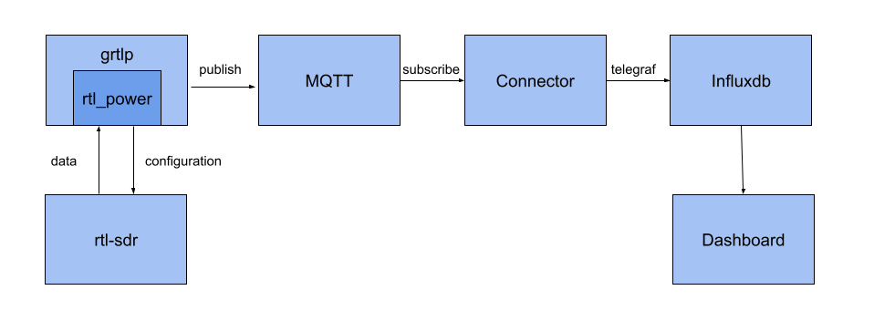
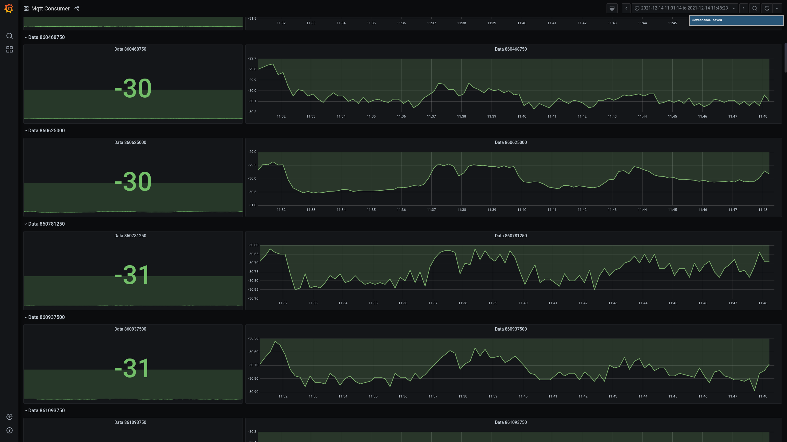
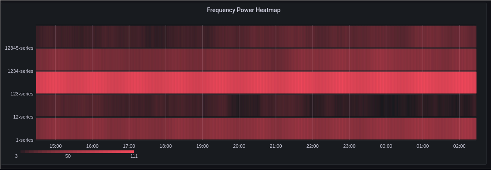

# Balena RTL Power
- [Introduction](#introduction)
- [Why not existing solutions?](#why-not-existing-solutions)
- [Why not rtl_power alone?](#why-not-rtl_power-alone)
- [Design](#design)
- [Usage](#usage)
- [Customization](#customization)

# Introduction
Balena RTL Power, a project to visualize and analyze signal frequency bands in a more simple and general way. This uses a [Software Defined Radio](https://www.wirelessinnovation.org/assets/documents/SoftwareDefinedRadio.pdf) (RTL-SDR Blog v3), [rtl power](http://kmkeen.com/rtl-power/) and balena! Balena-rtl-power provides a good 

## Why not existing solutions
Most tools often have a default display: the waterfall. This display has a steep learning curve in order to understand it. As a beginner to the space myself, I found it hard to see any other purpose of the SDR apart from listening in to radio frequencies using the display. That's just a few of the weaknesses I found using the existing tools but more can be found in the rtl_power [website](http://kmkeen.com/rtl-power/). To quote:

> - Limited frequency display. Usually can't do more than your SDR's native bandwidth.
> - Limited time display. If you didn't notice something, it just scrolls off the edge into the void.
> - Limited FFT bins. Usually doesn't work so well when you want substantially more bins than your screen has pixels.
> - Qualitative rendering. It is not easy to go from colors to dB.

## Why not rtl_power alone
- Balena's fleet management allows you to analyze multiple SDRs at different locations.
- Configuration is easy, just change a few variables in the web dashboard and you're good to go.
- Allows for a lot more extra use cases other than the heatmap.

## Design

- RTL-SDR - A cheap SDR that's a great starting point in working with SDRs. An SDR is a useful and flexible system in which radio configuration is easily done through software where originally it was done through different hardware. Instead of 5 or more radio hardwares for analyzing low-band to high-band frequencies, you now only need an SDR. 
- rtl_power - The software that configures how the SDR will operate. It configures what range of frequencies to cover, at what tuning, and also outputs the data that is being read.
- grtlp - A wrapper function I wrote in Golang so that the data can be sent through MQTT by default.
- MQTT - A lightweight messaging protocol that is suitable for IoT usecases.
- Connector - A balena block that automatically connects data sources with data sinks e.g, mqtt to influxdb.
- InfluxDB - InfluxDB is a time series database that is ideal for sensor readings or our signal power data.
- Dashboard - The primary output of this project. We will be using balena-dash, which is a balena block that provides a Grafana dashboard where you can easily visualize your data on your browser.

## Usage
There are 3 main variables needed to be specified -- The lower and upper frequency band (`LOWER_FREQ` & `UPPER_FREQ`) and the bin size (`BIN_SIZE`).  In simpler terms, you determine the frequency range of the signals you want to study and then determine the size of each division for that range.

To specify, add these device variables in the dashboard and specify the value for each. Values can be specified as an integer (89100000), a float (89.1e6) or as a metric suffix (89.1M). The bin size may be adjusted to make the math easier. Valid bin sizes are between 0.1Hz and 2.8MHz. Ranges may be any size. Default values are provided but it's not exactly useful for all cases.

## Customization
`INTERVAL` - Change this value to change the sampling interval. Include short hand time modifiers such as *s* for seconds, *m* for minutes, *h* for hours. The default interval is 10 seconds (10s).

`TUNER_GAIN` - Change this value to change the gain. Default is automatic configuration based on the dongle.

### Current output of the project
Displays a simple graph of the dbm for each frequency band:

### Future output of the project
This output will primarily be a Grafana heatmap to properly visualize the power of each frequency band at a certain time. Each band will be its own row and the color intensity of a block will represent the power. Like this: 

The top row is the higher frequency band and the lower frequency band is at the bottom row.
